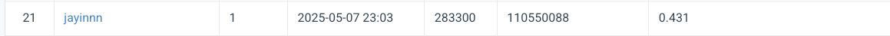

# NYCU-VRDL-HW3

Student ID: 110550088  
Name: 李杰穎

## Introduction

This project implements a cell instance segmentation solution using Mask R-CNN for the NYCU Visual Recognition and Deep Learning course (HW3). The goal is to accurately segment individual cell instances from microscopy images, distinguishing between different cell classes.

The implementation includes:

- **Mask R-CNN model** with multiple backbone options:
  - ResNet50-FPN (Feature Pyramid Network)
  - ResNet50-FPNv2 (improved FPN)
  - ConvNeXt with FPN

- **Dataset handling** for both training and testing:
  - Support for TIF image format
  - Multi-class instance segmentation (4 cell classes)
  - Data augmentation with Albumentations

- **Training pipeline** with:
  - Weights & Biases integration for experiment tracking
  - COCO evaluation metrics

- **Evaluation** in COCO format for submission

## Installation

### Requirements

```bash
# Clone the repository
git clone https://github.com/jayin92/NYCU-VRDL-HW3.git
cd NYCU-VRDL-HW3

# Install dependencies
pip install -r requirements.txt
```

The main dependencies include:
- PyTorch >= 1.7.0
- torchvision >= 0.8.0
- pycocotools >= 2.0.2
- albumentations >= 0.5.0
- Weights & Biases (wandb) >= 0.12.0

## Usage

### Training

```bash
python train.py \
  --data_dir data/train \
  --output_dir output \
  --backbone convnext \
  --variant base \
  --batch_size 2 \
  --epochs 20 \
  --optimizer adamw \
  --learning_rate 0.0003 \
  --grad_accum_steps 1 \
  --use_wandb \
```

Available backbone options:
- `fpn`: Standard ResNet50-FPN
- `fpnv2`: Improved ResNet50-FPNv2
- `convnext`: ConvNeXt + FPN (variants: tiny, small, base, large)

### Evaluation

```bash
python evaluate.py \
  --image_dir data/test_release \
  --model_path output/best_model.pth \
  --output_dir output/predictions \
  --backbone convnext \
  --variant base \
  --threshold 0.5 \
  --min_area 0.0 \
  --save_images
```

## Performance


